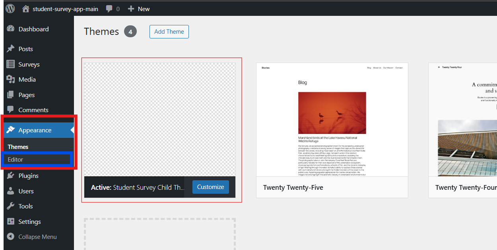
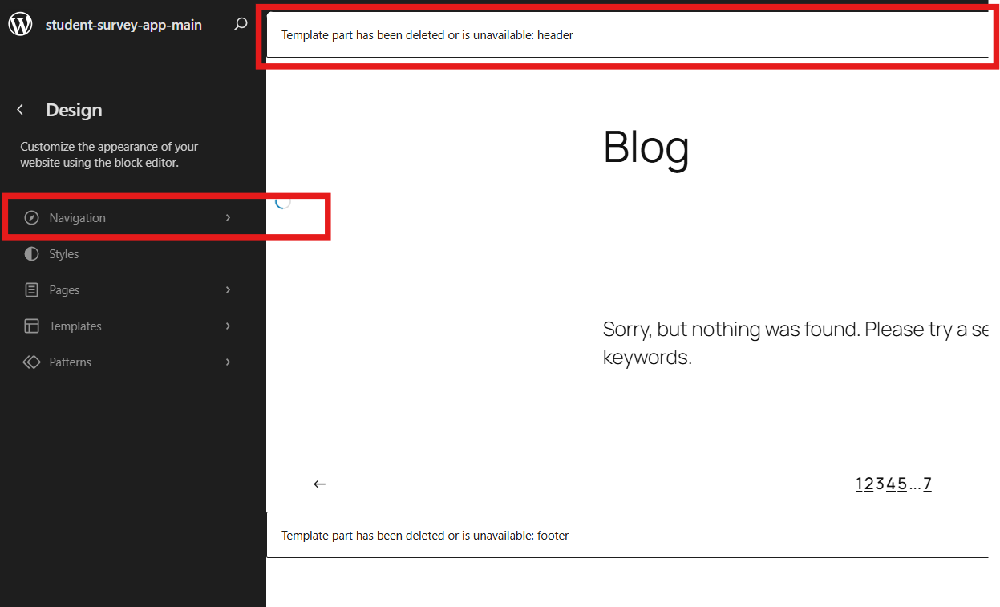
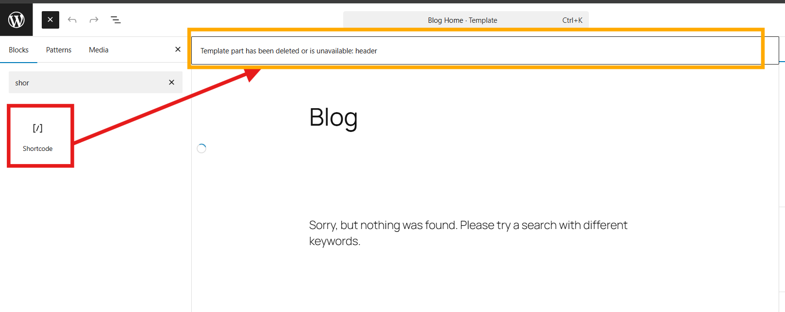
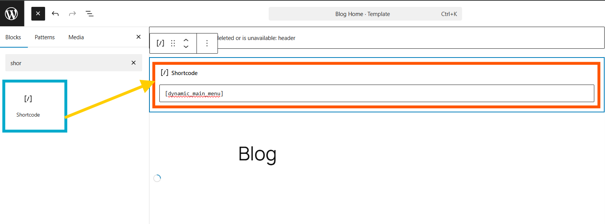

# Dynamic Menu Guide for Student Survey Theme

This guide explains how to activate and display the dynamic menu based on user roles (Admin, Instructor, Student) in the `student-survey-child` WordPress theme.

## 1. Prerequisites
- Make sure you are on the branch with the feature (`role-definition-and-register-reviewed` or `develop`).
- Clone/pull the `wp-content/themes/student-survey-child` folder and its subfolders (`inc/`).
- Activate the `student-survey-child` theme in the WordPress admin.

## Screenshot Example

Below is an example screenshot of the dynamic menu as seen by a logged-in Instructor:



## 2. How the Dynamic Menu Works
- The menu automatically adapts to the logged-in user's role:
  - **Admin**: Access to admin dashboard, user management, etc.
  - **Instructor**: Access to instructor dashboard, survey/class management.
  - **Student**: Access to student dashboard, feedback, etc.
- Visitors who are not logged in see Login and Register links.
- Registration automatically creates an account with the `student` role.

## 3. Displaying the Dynamic Menu

### Recommended Method (Full Site Editing)
1. **Open the WordPress Site Editor (Appearance > Editor)**


2. **Add a Shortcode block** in the header area or wherever you want the menu.





3. **Enter the following shortcode:**
   ```
   [dynamic_main_menu]
   ```
4. **Save your changes.**

The dynamic menu will automatically display and adapt to the user's role.

## 4. Customization
- The menu is styled via the theme's `style.css` file.
- Links and labels can be customized in `inc/dynamic-menu.php`.
- Roles and redirects are managed in `inc/roles.php` and `inc/auth-redirect.php`.

## 5. Troubleshooting
- If the menu does not appear: check that the `[dynamic_main_menu]` shortcode is inserted in the Site Editor or template.
- If roles are not recognized: check that the files in the `inc/` folder are present and included in `functions.php`.
- Clear your browser and WordPress cache if needed.

## 6. Going Further
- You can adapt links, labels, or restrictions.
- For questions, contact me (#AshDest) or consult the WordPress documentation on shortcodes and user roles.

---


