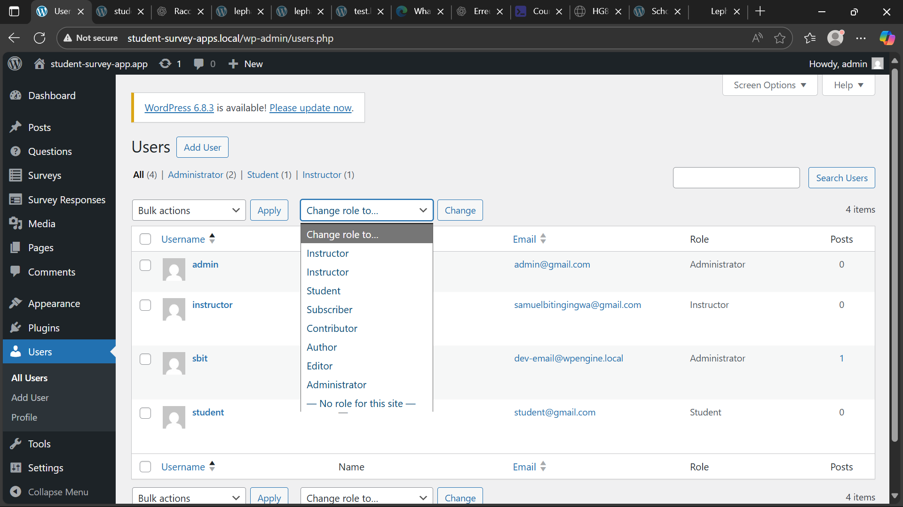
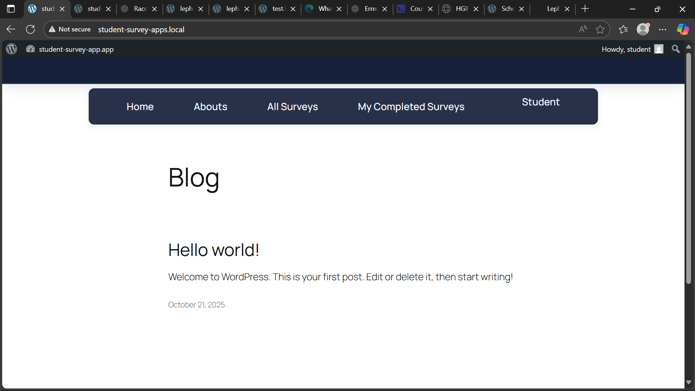
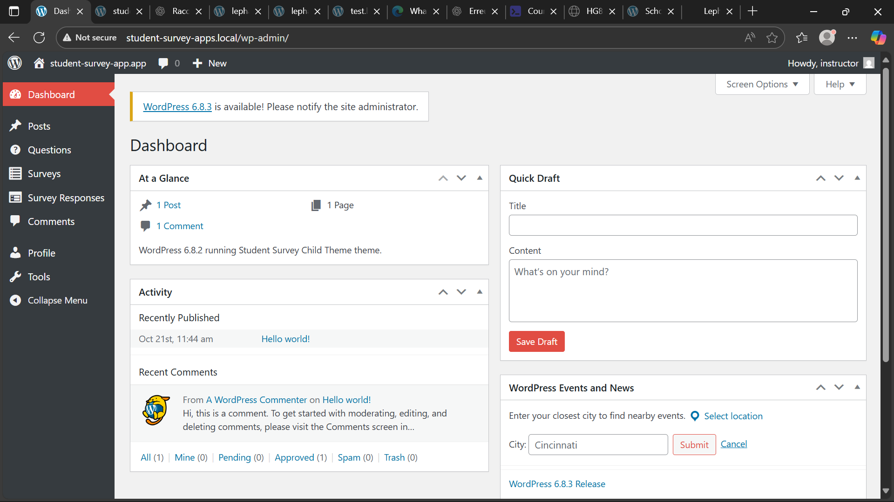

#  Documentation of the "feat: Implement Core Authentication & User Role Setup" feature
This document tracks the verification and testing of the **authentication system** and **user role configuration** implemented in the project.

## Overview
This feature introduces a **core authentication layer** in WordPress with **custom user roles** and redirection logic.  
It provides structured access levels to improve security and user flow.

### Roles implemented
| Role | Description | Access Level |
|------|--------------|--------------|
| **Administrator** | Full access to all site settings and user management. | Highest |
| **Instructor** | Can manage surveys, and see student submissions. | Limited Admin |
| **Student** | Can log in, view surveys(viewed surveys and submitted surveys), submit surveys. |  Frontend Only |

## Verification & testing procedures
### 1. Verify role registration
**Goal:** Confirm that all custom roles are registered and visible in the system.
**Steps:**
1. Log in as an **Administrator**.
2. Navigate to `Users > All Users` in the WordPress admin.
3. Click “Edit User” and check the **Role** dropdown.  

**Expected result:**  
All three roles (`Administrator`, `Instructor`, `Student`) appear in the dropdown and can be assigned to users.  

*Screenshot: Dropdown roles*  

---

### 2. Test student authentication & redirection
**Goal:** Ensure students can log in and are redirected properly.
**Steps:**
1. Log in with a **Student** account.
2. Observe redirection behavior after login.
3. Try to access `/wp-admin` manually.  

**Expected result:**  
- Students should be redirected to a **student dashboard** according to the usercase, but for now they are redirected to **the home page**.  
- Direct access to `/wp-admin` should be **blocked** or **redirected**  to "the home page".  

*Screenshot: Dropdown roles display in wp-admin*  

---

### 3. Test instructor authentication & access
**Goal:** Validate that instructors have restricted admin access.  
**Steps:**
1. Log in with an **Instructor** account.
2. Open the WordPress Dashboard.
3. Verify visibility of limited admin sections (e.g., `Survey`, `Questions`and `Survey Responses`).  

**Expected result:**  
Instructors should:
- See only permitted admin pages.  
- Be able to view and manage their own surveys or questions data.  
- Not access full administrative options.  

*Screenshot: Instructor Authentication & Access*  

---

## Summary
| Fully implemented              | Partially implemented               | Missing              |
| -------------------------------- | -------------------------------------- | ---------------------- |
| Role creation & redirection      | Account verification & custom messages | Login attempt tracking |
| Login access & secure validation | Custom “account not found” redirect    | Temporary lock logic   |
| Forgot password link             | Enhanced UI feedback                   |                        |

##  Developer notes
- **Location of Role Definitions:**  
  Roles are registered in `/inc/roles.php` using `add_role()`.
- **Redirection Logic:**  
  Managed in `/inc/auth-redirect.php` using `wp_redirect()` hooks.
- **Testing Environment:**  
  - WordPress 6.8.2  
  - PHP ≥ 8.0  
  - Local by flywheel - Version 9.2.5+6810

> **Author:** Samuel Bulangalizi and Ashuza Destin  
**Date:** October 2025  
**Status:** Tested and Verified  
**Commit Reference:** issue #33 - Title: docs: Verification and Documentation for User Roles & Auth Setup