# Full documentation
This is the full documentation to implement the project in your local environment.
## Installation
To install the project, follow these steps:
1. Clone the repository:
   ```bash
   git clone -b develop https://github.com/bahati7/student-survey-app.git your-project-name
   ```
2. Navigate to the project directory:
   ```bash
    cd your-project-name
    ```
## Project structure
The project is structured as follows:
```
your-project-name/
├── screens/
├── wp-admin/
├── wp-content/
└── wp-includes/
|__ documentation.md
|__ .gitignore
|__ .htaccess
|__ index.php
|__ license.txt
|__ readme.html
|__ wp-activate.php
|__ wp-blog-header.php
|__ wp-comments-post.php
|__ wp-config-sample.php
|__ wp-config.php
|__ wp-cron.php
|__ wp-links-opml.php
|__ wp-load.php
|__ wp-login.php
|__ wp-mail.php
|__ wp-settings.php
|__ wp-signup.php
|__ wp-trackback.php
|__ xmlrpc.php
```
## Usage
To use the project, follow these steps:
1. Open your database management tool (e.g., phpMyAdmin).
2. Create a new database for the project.

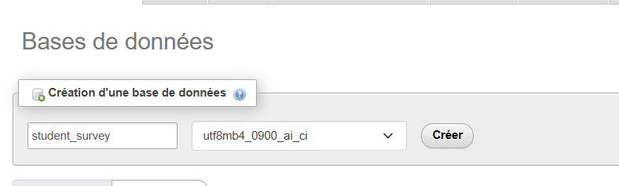

3. Open your web browser and navigate to `http://localhost/your-project-name`.
4. Follow the on-screen instructions to complete the installation.
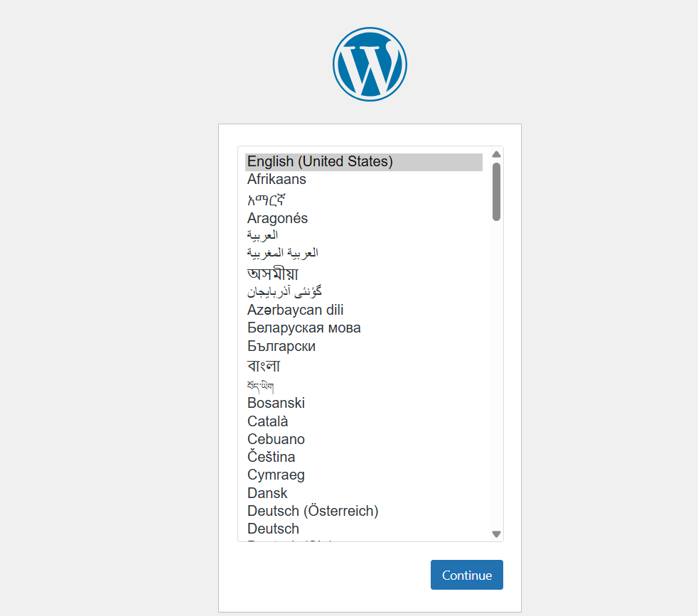
5. Enter the database details you created earlier.
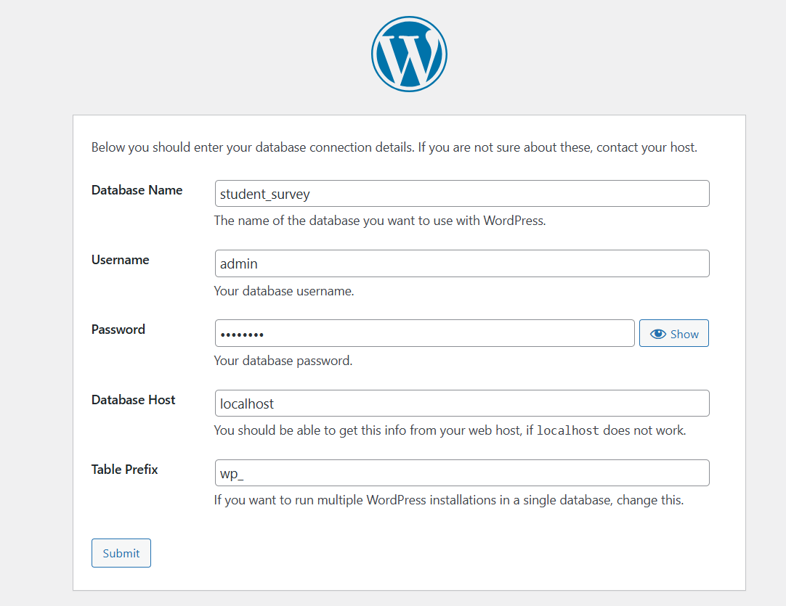

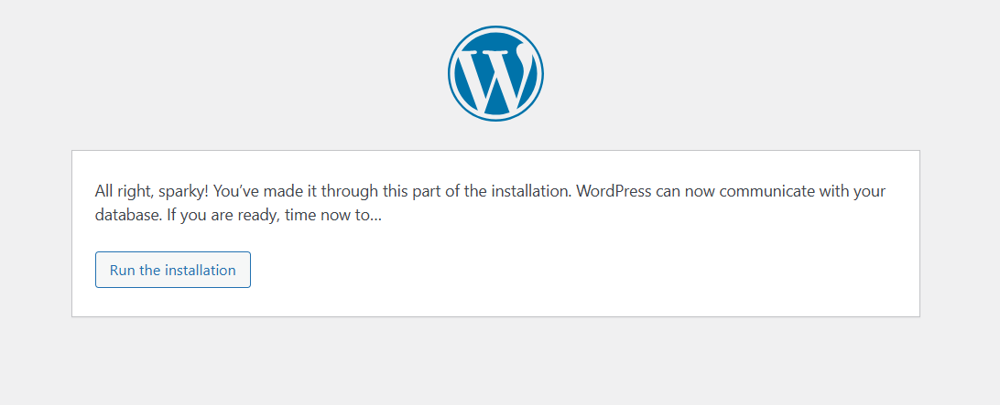
6. Complete the installation and log in to the admin panel.
[!Admin Setup Completed](images/success_install.png)
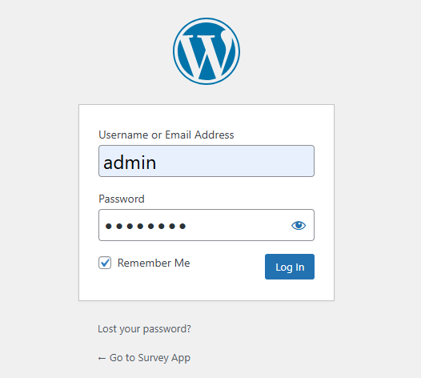
7. You can now start using the project and customize it as needed.
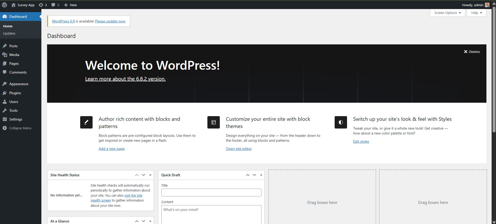

## Admin Setup
To follow the all custom Post types and taxonomies created for the project, navigate to the following sections in the admin panel:
- **Activate our child theme**
Go to Appearance > Themes and activate the child theme created for the project.


After activation, you can see this in the dashboard menu:
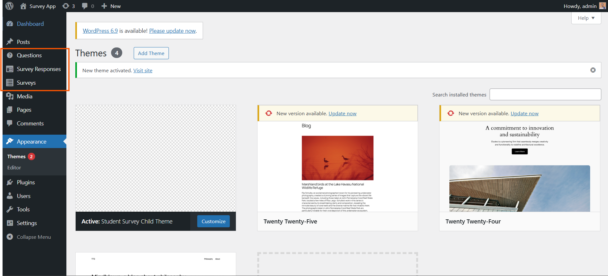
- **For add New Survey**
Go to Surveys > Add New to create a new survey.
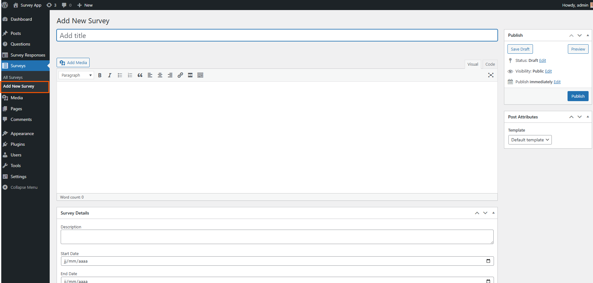
- **For View All Surveys**
Go to Surveys > All Surveys to view all created surveys.
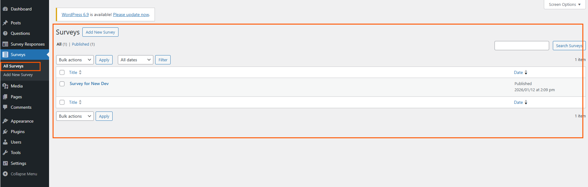
- **For add New Question**
Go to Questions > Add New to create a new question.
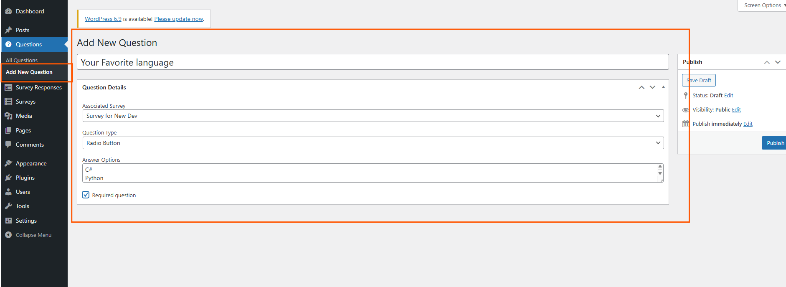
- **For View All Questions**
Go to Questions > All Questions to view all created questions.
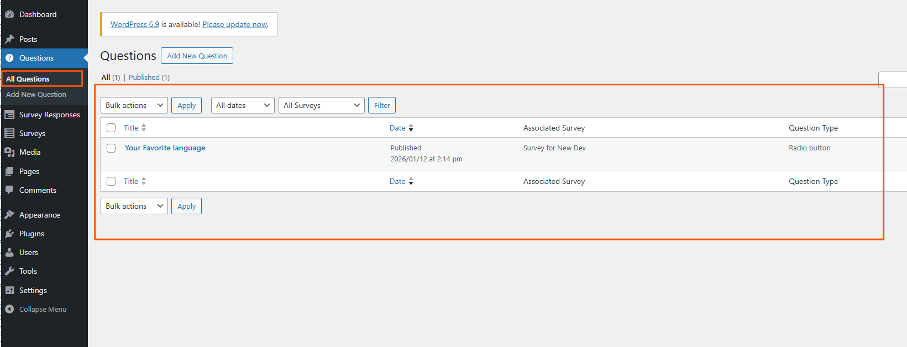
- **For view Results of Surveys**
Go to Survey Responses > All Results to view the results of surveys.
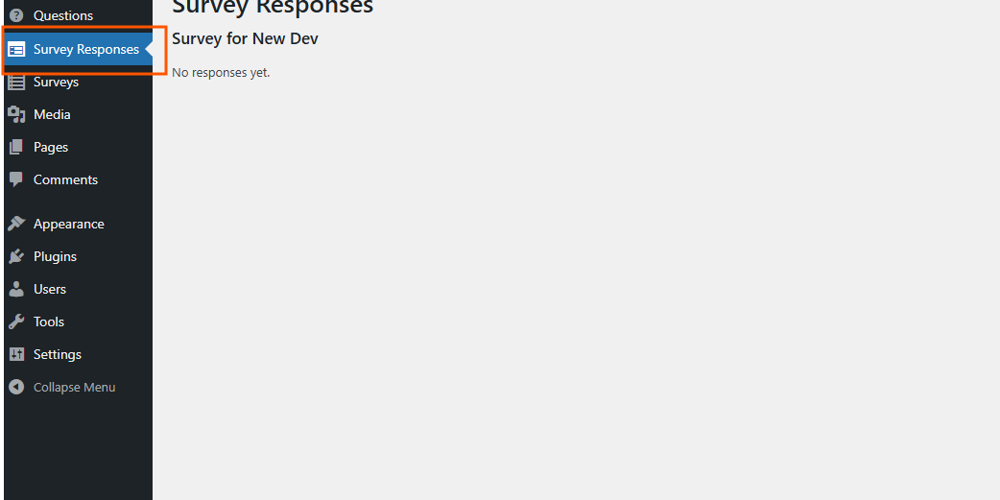

## Create Required Pages

Create these pages with their respective templates:

**1. Home Page:**
- Title: "Home"
- Template: "Home Context"
- Publish


**2. All Surveys Page:**
- Title: "All Surveys"
- Template: "All Surveys"
- Publish

**3. My Completed Surveys:**
- Title: "My Completed Surveys"
- Template: "My Completed Surveys"
- Publish

**4. Take Survey:**
- Title: "Take Survey"
- Template: "Survey Page"
- Publish


## Administrator Guide

### Dashboard Overview

As an administrator, you have full access to all WordPress features plus survey management.

### Managing Users

**Create Instructor:**

1. Go to **Users → Add New**
2. Fill in details:
   - Username
   - Email
   - First Name / Last Name
   - Password
3. **Role:** Select **"Instructor"**
4. Click **"Add New User"**


**Create Student:**

Students can self-register, but you can also create them:

1. **Users → Add New**
2. Fill in details
3. **Role:** Select **"Student"**
4. Click **"Add New User"**

**Change User Role:**

1. **Users → All Users**
2. Click **"Edit"** under user
3. Change **"Role"** dropdown
4. Click **"Update Profile"**

### Student Guide

#### Registration

**Self-Registration:**

1. On the homepage, click **"User" → "Register as Student"**

2. Fill in the registration form:
   - Username
   - Email

3. Click **"Register"**

4. You'll automatically be assigned the "Student" role

5. You'll be logged in and see the student menu

#### Viewing Available Surveys

1. After logging in, click **"All Surveys"** in the menu


2. You'll see a list of all active surveys


3. Click on a survey to view and respond

#### Taking a Survey

**Step 1: Access Survey**

1. Click on a survey from the list
2. The survey page opens with all questions

**Step 2: Answer Questions**

- **Text fields:** Type your answer
- **Radio buttons:** Select one option
- **Dropdowns:** Choose from the menu
- **Checkboxes:** Select multiple options
- **Text areas:** Write detailed responses

**Step 3: Submit**

1. Review your answers
2. Click **"Submit"** at the bottom
3. You'll see a confirmation message

#### Viewing Completed Surveys

1. Click **"My Completed Surveys"** in the menu

2. See a list of all surveys you've completed

3. Click on any survey to review your answers


#### Student Menu Overview

**When logged in as a student, you'll see:**

- **Home:** Return to homepage
- **About:** Information about the platform
- **All Surveys:** Browse and take surveys
- **My Completed Surveys:** View your history
- **[Your Name] (dropdown):**
  - Dashboard
  - Profile
  - Logout


## Troubleshooting
If you encounter any issues during installation or usage, consider the following troubleshooting steps:
- Ensure that your web server (e.g., Apache, Nginx) is running.
- Verify that the database credentials are correct.
- Check the file permissions to ensure that the web server can read and write to the necessary files.

### Technical Stack

- **CMS:** WordPress 6.0+
- **PHP:** 8.0+
- **Database:** MySQL 8.0+ / MariaDB
- **Parent Theme:** Twenty Twenty Five
- **Local Environment:** XAMPP / MAMP / WAMP